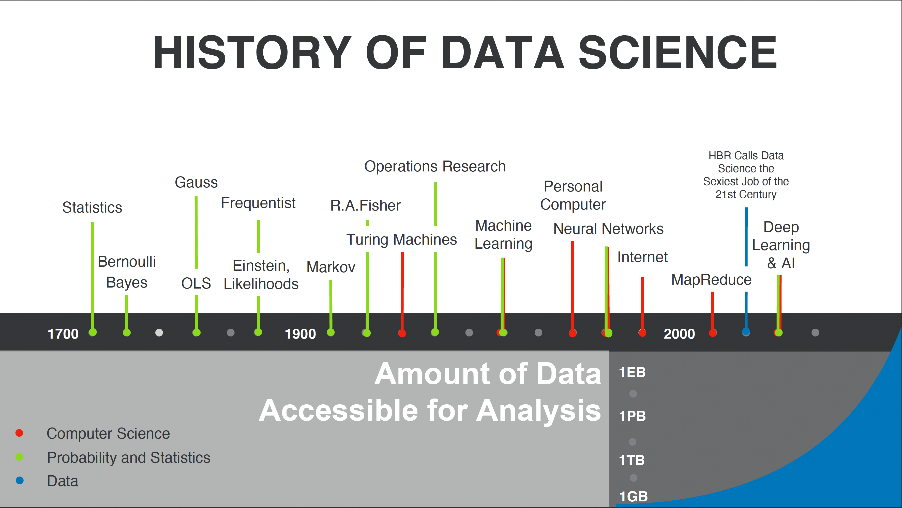

# ML in Practice

Steve Choi, David Good 
17-691 ML in Practice 
Lecture 1 
Scribe Notes 
 
---
## Course Summary
---
### Course Description

> The purpose of this course is to cover topics relevant to building a machine learning systems deployed into 
> operations. Such systems have technical requirements including data management, model development, and 
> deployment. However, business/organizational impacts must also be considered. Machine learning systems can be 
> expensive to produce and operate. Students will learn about trade offs in design, implementation, and expected 
> value.
### Course Goals

  * Course is less focused on algorithms and techniques
  * More focused on product management of ML products and services
  * Introducing scalability, reliability, maintainability to ML, which is hard to scale and introducing uncertainty
    * Course goal is to improve
      * Understanding about the assumptions of ML models
      * Creating value for the wider organization with ML
### Learning Objectives
  * Deploy products with ML/AI components
  * Build DE Systems and components
  * Measure value created by a ML system
  * Measure the value and quality of a production ML system
  
### Grading Policy
  * 60% - group project
  * 20% - class participation
    * Discussions
    * In-Class activities
  * 20% - assignments
    * Scribe
    * Others

## Lecture Notes
---
### History of Data Science
---
  * DS <> ML
  * ML is one of the popular tools for analyzing data
  * Data science is a combination of CS, Math, Data
  * Lack of access to data and computing power limited development of data science
  * Breakthroughs in NN and network computers, after dot com bust, computing and data storage became drastically cheaper
  
  

---
### Whata are we doing?
---
#### Thales of Miletus
  * Famous story from Aristotle about Thales of Miletus
    * From the stars, he took the data about the upcoming olive season and he took out leases on olives. Made a boat load of money by selling back the leases
    * Where to collect data? What can you do with that data to provide value? Can you capture that value?
#### Sir Francis Galton
  * Guess the weight of the ox
    * Guess correct, win the ox
  * Avg of all the guesses became better than the individual guesses
  * Collect data, using the data to make an inference, and using the inference to make a determination (weight of ox) 
  * In-class experiment with pushups of the above ox experiment
    * Produce data and processed it
  
#### Alan Turning
  * Famous for Turning test and Turning machines
    * Person interacting with computer doesn't realize they're interacting with computer == Turing Test
  * Google example of passing the Turing Test
    * https://www.youtube.com/watch?v=D5VN56jQMWM
    * Very impressive demonstration of ML
    * Value to users is questionable
    * "Would you use it to make a reservation?"
      * "Use OpenTable"
      * What value does AI add in this case?
      * e.g. Google Assistant vs Grammarly value proposition
  * the value incentive of the internal researchers and the external users are misaligned. the ways external users can use the service may be different than what internal researchers had intended for it to be used
  
#### Zillow and Opendoor
* [Zillow's home-buying debacle shows how hard it is to use AI to value real estate by Rachel Metz](https://www.cnn.com/2021/11/09/tech/zillow-ibuying-home-zestimate/index.html)
* [Invaluable Data Science Lessons To Learn From The Failure of Zillow’s Flipping Business by Shara Kumar Ravindran](https://towardsdatascience.com/invaluable-data-science-lessons-to-learn-from-the-failure-of-zillows-flipping-business-25fdc218a62)
* Zillow – real time information about housing in Pittsburgh
  * Tried to buy houses that were underpriced
* Opendoor – we can do better. Buying houses that are underpriced and flipping them
  * Opendoor thought they could be better at predicting prices relative to Zillow
  * Lost too much money and decompose that from a ML perspective
* Key Class Takeaways on Opendoor
   * Less reliance on ML
   * Incorporate other business metrics to improve business decision making
   * Misapplication of the actual algorithm
   * Unstable/inaccurate data
   * More human expert inputs – local experts of the market, manual inspections - could have improved decision making for Opendoor
   * Lack of quality data - better, higher quality data and more features introduced to the model will improve results
   * Manual price overrides from humans would be a good feature to have
   * Issues with data collection processes
   * Data skew would impact model results
   * Edge case scenarios - e.g. unforseen circumstances - were not accounted for
   * More model testing would have improved outcome of Opendoor
   * Did not take into account unquantifiable variables into the model
   * Algorithm architecture affects model results. look at the mechanisms to address issues on the fly
   
---
### Reading Notes
---
### [Data Scientist: The Sexiest Job of the 21st Century](https://hbr.org/2012/10/data-scientist-the-sexiest-job-of-the-21st-century)
* Goldman of LinkedIn developed a key feature with the backing of then CEO, who realized the power of analytics from previous ventures, to improve LinkedIn’s click through rate by over 30%
* In 2012, there was a severe shortage of data scientists and created bottleneck situations across industries
* Data scientists are professionals who code and find trends in big data
* Data scientists are going to be very well regarded in the future and will thrive in a setting where they have the freedom to explore and generate ideas for the organization

### [Companies are Failing in their Efforts to Become Data-Driven](https://hbr.org/2019/02/companies-are-failing-in-their-efforts-to-become-data-driven)
* Leading companies are struggling to become data driven due to organizational misalignment and cultural resistance
  * Significant investments are being made to build a data driven infrastructure and culture
  * Firms must become more serious about investing in the human side of data if they want to become more data driven

### [Zillow's home-buying debacle shows how hard it is to use AI to value real estate](https://www.cnn.com/2021/11/09/tech/zillow-ibuying-home-zestimate/index.html)
* Zillow tried to use the Zestimate to buy homes but after 8 months, shut down the home buying business
* Challenges was to forecast home prices with a 3-6 month horizon
### [Invaluable Data Science Lessons To Learn From The Failure of Zillow’s Flipping Business](https://towardsdatascience.com/invaluable-data-science-lessons-to-learn-from-the-failure-of-zillows-flipping-business-25fdc218a62)
* As the amount of Zillow's amount home data increased the quality of their models degraded
  * Data quality issues - Zillow relied on both public and user data
  * A relatively small data quality issue with accuracy problems results in a large monetary loss
    * Data Quality is hugely important - use metrics to measure data quality
    * Dependency on  algorithms
      * Where predicitons are critical use model outputs shouldn't be used to make decisions, only as supplemental information
    * Gaming the system
      * Utilize a fraud prevention team to ensure the domain isn't being manipulated fraudulently
    * Selective Focus
      * Study data science problems holistically from many perspectives before and after implementing a model
    * External Factors
      * Diversify risk and make efforts to account for external factors (e.g. labor costs rising/falling)
### [Reddit Thread](https://www.reddit.com/r/datascience/comments/qwqbxn/zillow_loses_billions_on_house_price_prediction/)
    * Mentions various issues with the underlying data that powered the algorithm
    * Mistrained the model on an bull market for housing
    * Some rumors about business decisions not being in line with model recommendations

